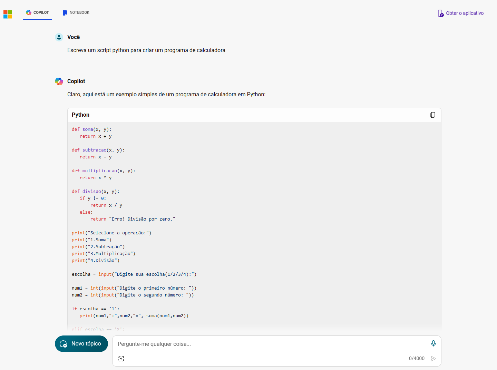
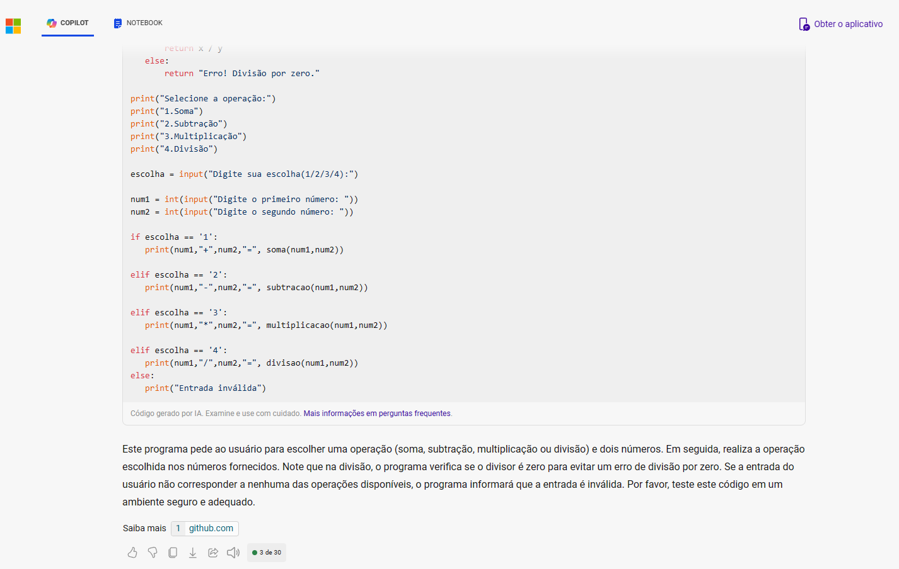
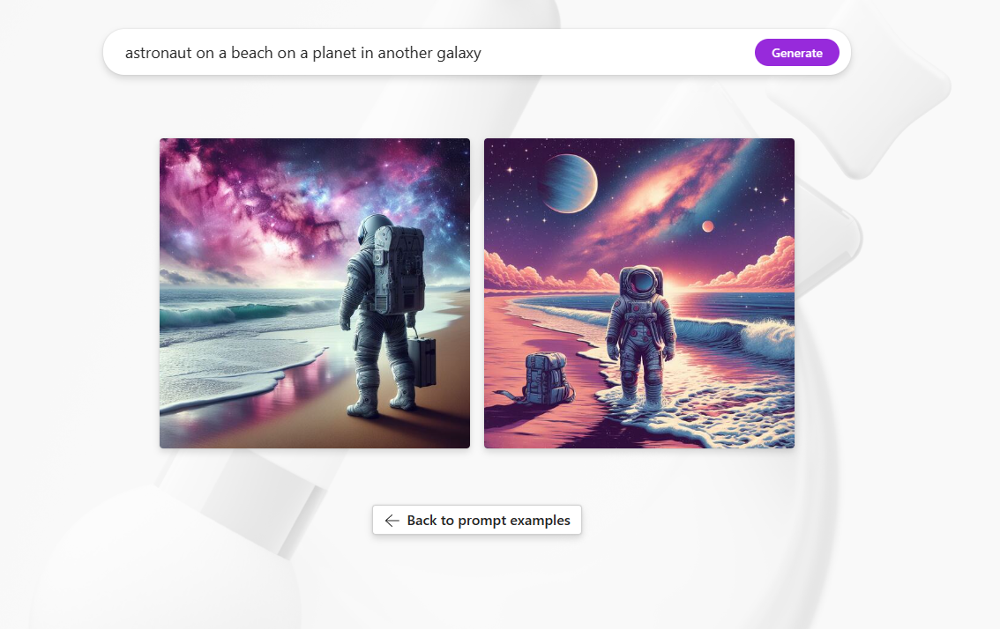

# Exploring Resources with Microsoft Copilot

This repository has the purpose of storing the project developed within the scope of the "Working with Generative AI" module of the "Microsoft Azure AI Fundamentals" Bootcamp by [DIO](https://www.dio.me/), under the instruction of the teacher [Valéria Baptista](https://www.linkedin.com/in/valeriabaptista/).

The project is an essential requirement for passing the "Working with Generative AI" module, consolidating participants practical learning and preparing them for subsequent challenges.

This repository was created to provide a comprehensive overview of the extraordinary features provided by Microsoft Copilot. Equipped with advanced artificial intelligence, Copilot stands out as a versatile productivity tool, finding applications that transcend the scope of code development, extending to the sphere of creative content creation.

By exploring this repository, users will have the opportunity to delve into the many facets of Copilot, understanding not only its effectiveness in the context of software development, but also its transformative potential in other domains. From responsive and accurate code suggestions to assistance with creative tasks, this repository will serve as a comprehensive guide, featuring exemplary use cases that highlight the positive impact Copilot can have across multiple disciplines.
 
## Smart Replies

First, let's access the Microsoft Copilot portal: https://copilot.microsoft.com/

Microsoft Copilot's Smart Reply feature is a feature that allows the assistant to generate relevant and useful responses to users' questions or requests. It uses artificial intelligence technologies to understand the context of the conversation and provide accurate information.

Let's ask Copilot for a list of pros and cons for making a career transition.

  

## Code Generation

The Microsoft Copilot code generation feature is a tool powered by artificial intelligence, whose functionality is to assist developers in creating code, providing greater optimization of the process.

Vamos solicitar que o Copilot da Microsoft crie uma calculadora na linguagem de programação Python.

  

  

Script em Python: [calculator.py](./outputs/calculator.py)

## Image Generation

The **Microsoft Copilot's image generation feature** is a powerful functionality that allows you to create images based on words or descriptions. Let me explain how it works:

1. **Image Creator from Microsoft Designer**:
   - The **Image Creator** is a tool that is part of **Microsoft Copilot**.
   - It enables you to **generate images from words using AI**.
   - You can input a description or prompt, and Copilot generates a relevant image based on that input.
   - This functionality is useful for creating illustrations, charts, or any type of image related to your content⁴.

2. **How to Use**:
   - Visit the [Image Creator](https://copilot.microsoft.com/images/create) and enter your description or prompt.
   - Copilot will use **artificial intelligence** to generate a corresponding image.
   - You can fine-tune the description or try different prompts to achieve varied results.

3. **Example**:
   - Let's say you want an image of an **astronaut on a beach in a galaxy from another dimension**.
   - Simply input that prompt into the Image Creator, and Copilot will create a related image.

  

Generate images: [image_1](./outputs/image_1.jpeg) and [image_2](./outputs/image_2.jpeg).

## Useful Links:

[Explore generative AI with Microsoft Copilot](https://microsoftlearning.github.io/mslearn-ai-fundamentals/Instructions/Labs/12-generative-ai.html)

[Explore Azure OpenAI](https://microsoftlearning.github.io/mslearn-ai-fundamentals/Instructions/Labs/13-azure-openai.html)

[Explore content filters in Azure OpenAI](https://microsoftlearning.github.io/mslearn-ai-fundamentals/Instructions/Labs/14-azure-openai-content-filters.html)

## Tecnologias Utilizadas

- Microsoft Copilot

## Contributions

Contributions are welcome. Feel free to suggest improvements and possible fixes to the code through an issue or pull requests.

## Author

Jadeson Bruno Albuquerque da Silva

